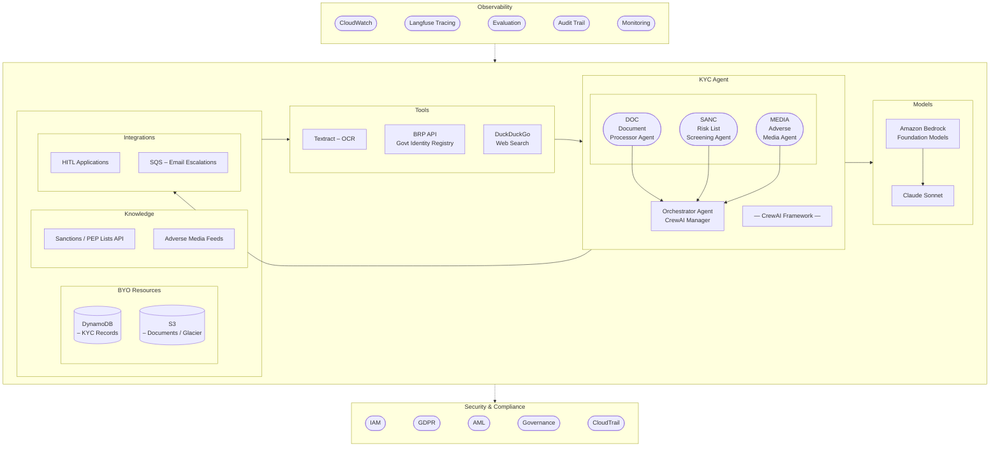

# KYC Agent — Logical Architecture

---

## Changes from Prior Architecture Slide

| Aspect | Slide (Previous) | Current Implementation |
|---|---|---|
| **Model** | Mistral 3 8B (default) + Sonnet 4.5 (fallback) | **Claude Sonnet** via AWS Bedrock (model ID from SSM Parameter Store) |
| **Agents** | Orchestrator + Document Processor + Sanction Agent | Orchestrator + Document Processing + **Risk List Screening** + **Adverse Media** |
| **Pipeline** | Fan-out implied | Sequential: Doc → Risk → Media → Orchestrator |
| **OCR Tool** | Textract + Rekognition (face) | **Textract only** (no face recognition) |
| **Adverse Media** | Not shown | DuckDuckGo search + LLM analysis |
| **Govt Verification** | Not shown | Dutch BRP API |
| **Observability** | CloudWatch | CloudWatch + **Langfuse** tracing |

---

## Agent Decision Matrix

| Document | Risk List | Adverse Media | Decision |
|---|---|---|---|
| MATCH | CLEAR | OK | **APPROVED** |
| anything else | anything | anything | **ESCALATED → PENDING_HUMAN_REVIEW** |

Escalation triggers an SQS notification to the human review queue.
